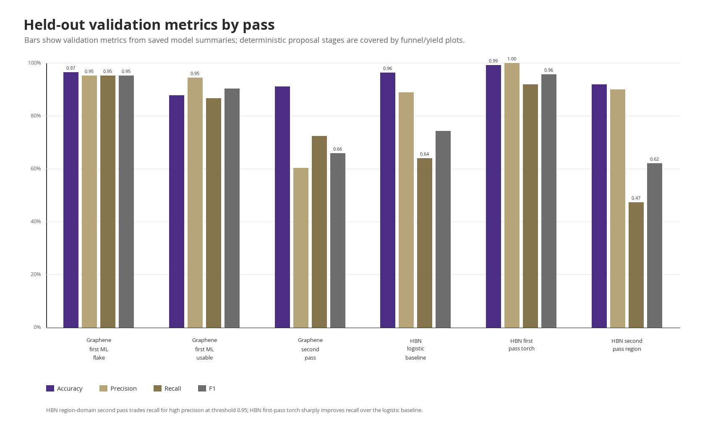
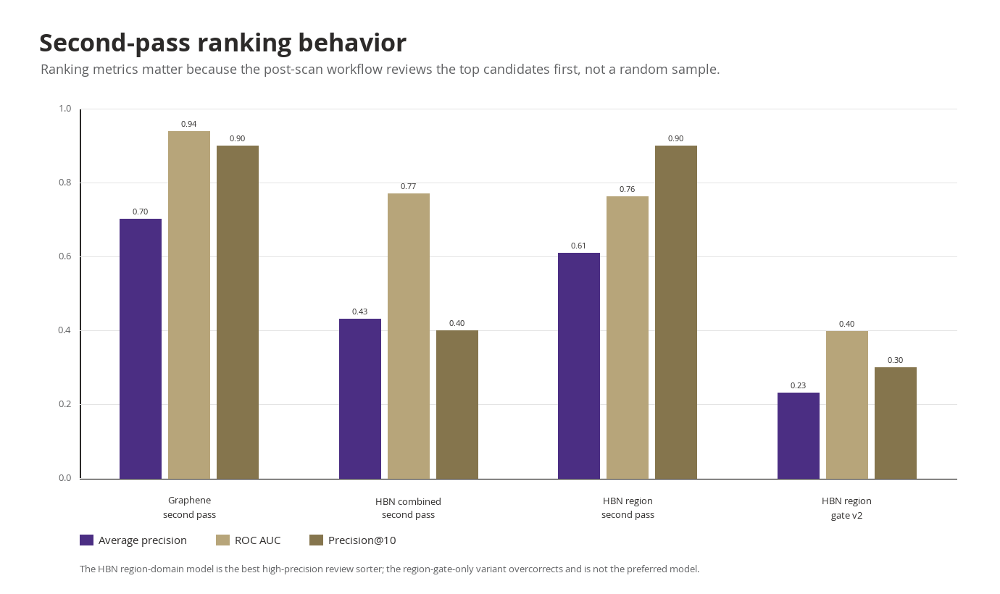
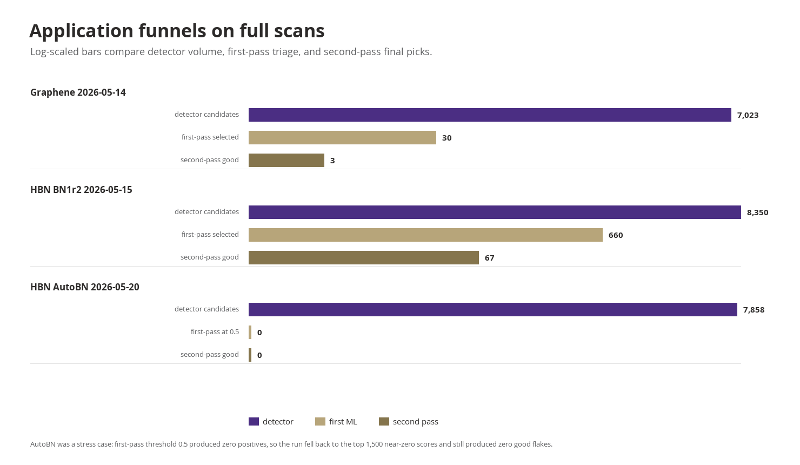
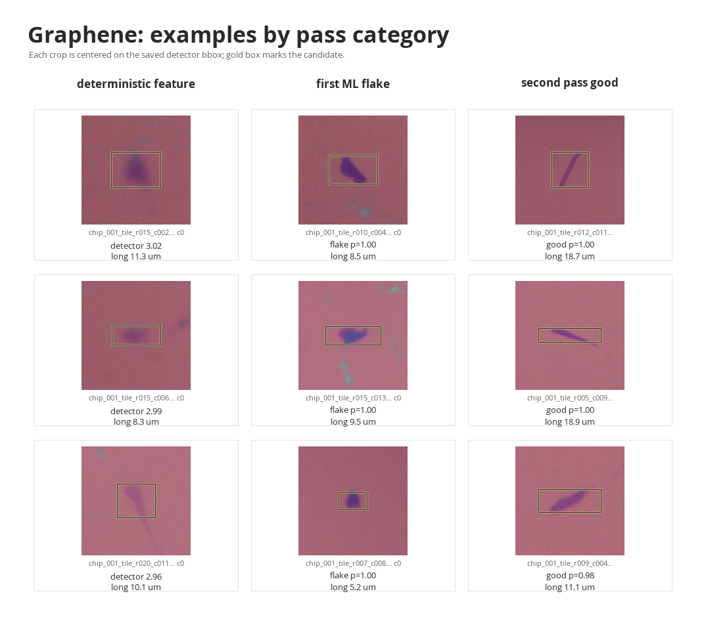
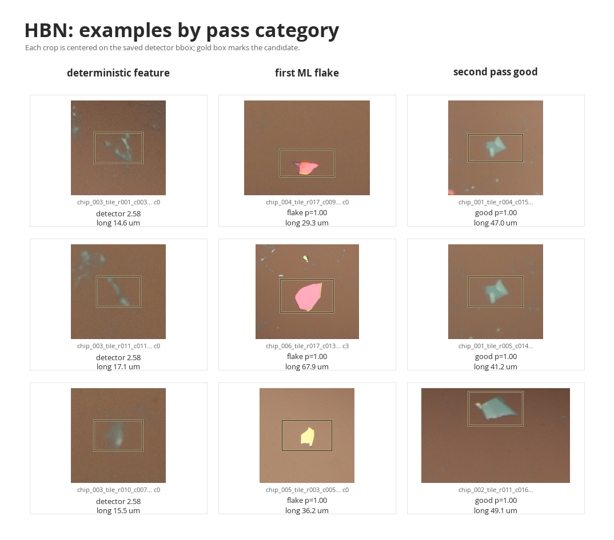
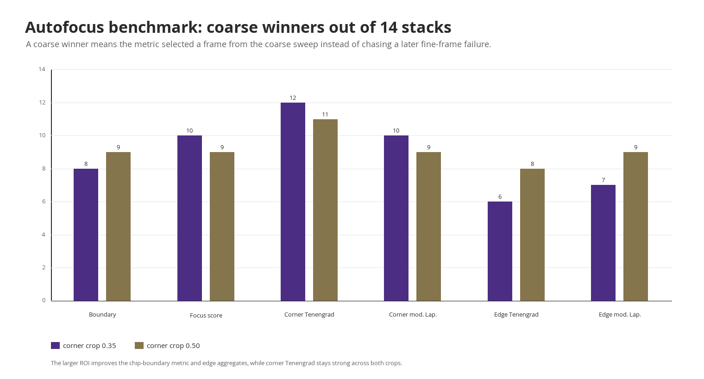
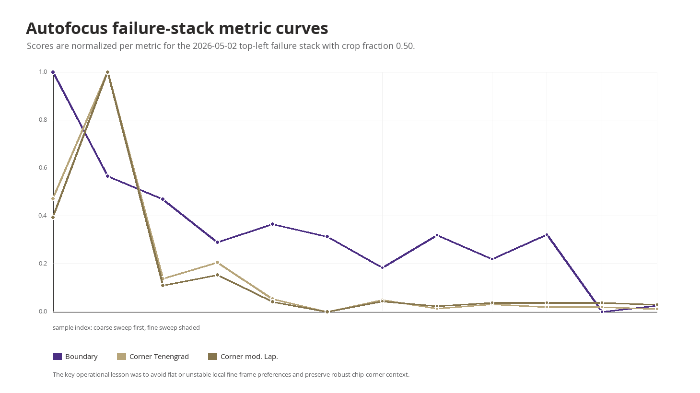
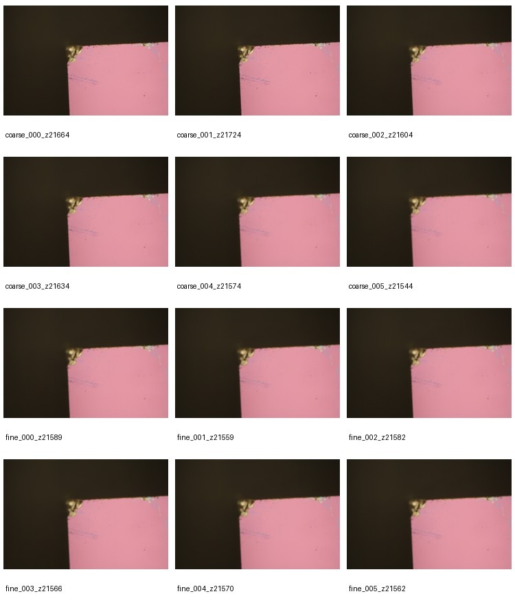

# FlakeID Pass Performance Report

Generated 2026-07-13 from saved local FlakeID artifacts in `outputs/` and `photos/scans/`.

This report covers the deterministic proposal pass, the first ML triage pass, the second good-flake pass, and the autofocus work. The main caveat is that the deterministic pass is a proposal generator, not a closed-set classifier. Its "performance" is best read from proposal yield and full-scan funnel counts unless we add exhaustive ground truth over all pixels or all possible flakes.

## Executive Summary

- Graphene first-pass logistic classification is strong on the reviewed validation set: 96.6% accuracy, 95.3% precision, 95.3% recall, and 95.3% F1 for flake-present labels.
- Graphene usable-thickness classification is also useful but less perfect: 87.8% accuracy and 90.4% F1. This is the pass that turns "flake" into likely few-layer/usable material before ranking.
- Graphene second-pass good/bad ranking has high ranking quality, with AP 0.703, ROC AUC 0.940, and P@10 0.900. Its thresholded precision is lower, 60.4%, because it is deliberately recovering many good candidates from a small positive class.
- hBN first-pass torch classification is the strongest hBN model so far: 99.4% validation accuracy, 100.0% precision, 92.0% recall, and 95.8% F1 at threshold 0.90.
- hBN second-pass good/bad is the hardest piece. The best review-sorting version is the region-domain model: 91.9% accuracy, 90.0% precision, 47.4% recall, 62.1% F1, AP 0.610, and P@10 0.900. That is a high-precision sorter, not yet a high-recall final classifier.
- Autofocus work found that ROI selection mattered more than the specific sharpness metric. A larger corner ROI around 0.50 preserved chip-corner context and reduced failures where the fine pass chased a worse frame.

## Pass Definitions

1. **Deterministic proposal pass**
   - Purpose: find anything flake-like or feature-like at high recall before any classifier decides whether it is worth review.
   - Main implementations: `src/flake_ml/detection/graphene.py`, `src/flake_ml/detection/opencv_contours.py`, and `src/flake_ml/detection/qumus_lab.py`.
   - Output: candidate bounding boxes, physical-size estimates, detector scores, and color/shape features.

2. **First ML pass**
   - Purpose: decide whether a detector proposal is actually a flake, and for graphene also whether it has usable thickness.
   - Graphene implementation: hand-feature logistic models in `src/flake_ml/learning/candidate_baseline.py`.
   - hBN implementation: torch image-plus-metadata model trained by `scripts/train_first_pass_torch.py`.

3. **Second pass / good-flake ranking**
   - Purpose: rank first-pass flakes by whether they are actually worth pursuing.
   - Implementation: torch good/bad classifier in `src/flake_ml/learning/candidate_good_bad_torch.py`.
   - Output: `good_probability`, `predicted_good`, ranked galleries, and final candidate JSON.

## Validation Metrics

| Material | Pass / model | Eval set | Threshold | Accuracy | Precision | Recall | F1 | Ranking metrics |
| --- | --- | ---: | ---: | ---: | ---: | ---: | ---: | --- |
| Graphene | First ML flake-present logistic | 232 val | 0.50 | 96.6% | 95.3% | 95.3% | 95.3% | -- |
| Graphene | First ML usable-thickness logistic | 90 val | 0.50 | 87.8% | 94.5% | 86.7% | 90.4% | -- |
| Graphene | Second-pass good/bad torch, run 3 | 342 val | 0.95 | 91.2% | 60.4% | 72.5% | 65.9% | AP 0.703, AUC 0.940, P@10 0.900 |
| hBN | First-pass logistic baseline | 312 val | 0.50 | 96.5% | 88.9% | 64.0% | 74.4% | -- |
| hBN | First-pass torch | 312 val | 0.90 | 99.4% | 100.0% | 92.0% | 95.8% | AP 0.955, AUC 0.980 |
| hBN | Early second-pass good/bad torch | 42 val | 0.65 | 69.0% | 50.0% | 84.6% | 62.9% | AP 0.578, AUC 0.732, P@10 0.400 |
| hBN | Combined second-pass good/bad torch | 136 val | 0.90 | 83.1% | 42.3% | 57.9% | 48.9% | AP 0.433, AUC 0.771, P@10 0.400 |
| hBN | Region-domain second-pass good/bad torch | 136 val | 0.95 | 91.9% | 90.0% | 47.4% | 62.1% | AP 0.610, AUC 0.763, P@10 0.900 |
| hBN | Region-gate v2 variant | 136 val | 0.05 | 86.0% | 0.0% | 0.0% | 0.0% | AP 0.232, AUC 0.399, P@10 0.300 |

The hBN region-gate v2 row is included as a warning. It gets superficially high accuracy by predicting no positives on an imbalanced validation set. Precision, recall, and F1 correctly show that this is not a usable classifier.

The ranking plot is especially relevant for post-scan review. Even when thresholded F1 is modest, a high P@10 means the top of the ranked list is productive for a human or an automated follow-up workflow. That is why the hBN region-domain model is more useful than the combined model despite similar ROC AUC.

## Deterministic Proposal Yield And Full-Scan Funnels

| Material / run | Images | Detector or reviewed proposals | First-pass selected | Second-pass good | Notes |
| --- | ---: | ---: | ---: | ---: | --- |
| Graphene reviewed labels | -- | 1,244 binary reviews | 495 flakes in labels | -- | Reviewed proposal yield: 39.8% flake |
| hBN reviewed labels | -- | 1,531 binary reviews | 160 flakes in labels | -- | Reviewed proposal yield: 10.5% flake |
| Graphene scan `20260514T014605Z_flake_grid_001` | 316 | 7,023 detector candidates | 30 usable first-pass candidates | 3 good | Graphene detector plus logistic first pass, then good/bad torch |
| hBN scan `20260515T051601Z_Isaac_BN1r2` | 2,112 | 8,350 size-pass candidates | 660 first-pass flakes | 67 good | hBN material mode, first-pass torch threshold 0.90 |
| hBN scan `20260520T044855Z_IsaacV_AutoBN01` | 1,093 | 7,858 size-pass candidates | 0 at threshold 0.50 | 0 good | Fallback ranked top 1,500 near-zero first-pass scores; domain/threshold stress case |

The full-scan funnels show the operational compression. Graphene went from 7,023 detector candidates to 30 first-pass candidates to 3 final good candidates. The successful hBN BN1r2 scan went from 8,350 detector candidates to 660 first-pass flakes to 67 good candidates. The later AutoBN run shows a generalization failure: the first-pass model produced zero positives at the requested threshold and the fallback still produced zero good candidates.

One bookkeeping caveat: the BN1r2 post-scan summary is marked `material: hbn`, but its cached detector JSON is named `graphene_detector_scan.json`. The report treats it as hBN because the downstream post-scan material mode, first-pass model, and second-pass model are hBN-specific.

## Visual Category Grids

These grids show what the three pass categories look like in practice. The first column is a deterministic feature that did not pass first ML. The second is a first-pass ML flake that was not one of the final good picks. The third is a second-pass good candidate.

The grids also explain the qualitative difference between graphene and hBN. Graphene candidates often appear as subtle purple/dark contrast changes on the 285 nm oxide background. hBN candidates include much more color diversity and more nuisance objects, including bright/pink regions that motivated the region-domain and pink-veto work.

## Deterministic Methodology

The deterministic layer is deliberately conservative. It tries to propose candidate regions, not decide final utility.

- `Graphene285nmDetector` white-balances from image borders, estimates local background, and scores color/luminance anomalies using signals such as red-green, blue-green, purple shift, chroma delta, darkness, local contrast, edge support, compactness, fill ratio, and size. It then runs morphology and connected-component filtering to emit scored boxes.
- `OpenCvContourFlakeDetector` uses LAB/color preprocessing, contour extraction, Canny/edge information, foreground masks, and material-specific plausibility filters. For hBN it adds color-region constraints, substrate/ring checks, shape filters, and size filters to suppress scratches, dirt, and line-like contours.
- `QumusLabDetector` is a LAB-equalized detector with material-specific plausible masks, foreground thresholds, optional benchmark profiles, and edge/shape filters. It is designed to be more substrate-aware and configurable for hBN and graphene.
- In Qumus LAB deterministic post-scan mode, `src/flake_ml/post_scan.py` can write all size-pass detector candidates as deterministic flake predictions with probability 1.0. That is a workflow fallback, not a learned probability estimate.

Because the detector proposes boxes without exhaustive negative sampling, accuracy/precision/recall are not well-defined for the deterministic pass alone. The meaningful detector-level numbers currently available are candidate volume, reviewed-label yield, and downstream survival through the first and second passes.

## ML Methodology

### Graphene first pass

The graphene first-pass models are logistic classifiers trained from reviewed detector candidates. The feature vector includes detector score, candidate area, bounding-box dimensions, tile-level candidate counts, RGB/HSV summary statistics, luma variation, fill ratio, compactness, purple shift, darkness, chroma delta, color anomaly, contrast, edge score, and aspect ratio.

Two graphene logistic tasks are trained from the same review set:

- `flake_present`: flake vs no-flake. Validation: 81 TP, 143 TN, 4 FP, 4 FN.
- `usable_thickness`: few-layer/usable vs thick among flakes. Validation: 52 TP, 27 TN, 3 FP, 8 FN.

The first production graphene funnel applies both thresholds at 0.50, so a candidate must look like a flake and look thickness-usable before it is passed to the good/bad ranker.

### hBN first pass

The hBN first-pass torch model uses a pretrained MobileNetV3-Small image backbone plus metadata features. Candidate crops are generated with surrounding context and a 0.55 padding fraction, then trained against `hbn_first_pass_candidate_reviews.json`. Training used an 80/20 split, seed 13, weighted sampling, class-weighted BCE, image size 224 px, and 80 epochs.

The recommended threshold from validation is 0.90. At that threshold the validation split had 23 TP, 287 TN, 0 FP, and 2 FN. This is a major improvement over the hBN logistic baseline, mostly by lifting recall from 64.0% to 92.0% while removing false positives on the validation split.

### Second-pass good/bad models

The good/bad models use the same broad architecture family: MobileNetV3-Small crop features plus metadata. Metadata includes detector score, physical size, RGB/HSV summaries, channel differences, shape features, edge/contrast features, and, for hBN region experiments, color-region descriptors.

Graphene second-pass training used 1,839 labeled candidates, with 178 positives and 1,661 negatives. The chosen run used image size 192 px, 14 epochs, learning rate 0.00025, and threshold 0.95.

hBN second-pass training evolved through several attempts:

- Early hBN model: only 196 labels. It had good recall, 84.6%, but weak precision, 50.0%.
- Combined hBN model: 856 labels. It was more stable but still low precision, 42.3%.
- Region-domain hBN model: same 856 labels plus color-region gating/metadata and pink-veto logic. It reached 90.0% precision and P@10 of 0.900, at the cost of recall.
- Region-gate v2: an overcorrection. It predicted no positives on validation, so it should be treated as a failed variant rather than an operational model.

## Autofocus Summary

The autofocus effort focused on failure cases where the runtime began at a good coarse frame, then moved to a worse fine-frame choice. The benchmark compared the current chip-corner boundary/focus score with Tenengrad, variance of Laplacian, modified Laplacian, and Brenner-style metrics over corner crops and edge strips.

Across 14 saved autofocus stacks, larger corner crops improved or stabilized the metrics that rely on chip-edge context:

- Boundary metric: 8/14 coarse winners at crop 0.35, 9/14 at crop 0.50.
- Edge harmonic-mean Tenengrad: 6/14 coarse winners at crop 0.35, 8/14 at crop 0.50.
- Edge harmonic-mean modified Laplacian: 7/14 coarse winners at crop 0.35, 9/14 at crop 0.50.
- Corner Tenengrad was strong in both settings: 12/14 at crop 0.35 and 11/14 at crop 0.50.

The practical recommendation is to use a larger corner ROI around 0.50, keep the chip-corner boundary metric as the global objective, use a derivative metric as a local tie-breaker, and avoid taking fine-pass moves when the curve is flat or unstable.

## Most Useful Next Plots

- Precision-recall curves and threshold sweeps per material, especially for hBN second-pass variants.
- Calibration plots for first-pass and second-pass probabilities. The AutoBN run suggests hBN first-pass probabilities are not yet robust across domains.
- Per-chip funnel histograms for first-pass and second-pass survival rates.
- False-negative galleries for hBN first pass and region-domain second pass.
- Detector recall audit from dense manual labels, so the deterministic proposal pass can get true recall and false-negative estimates rather than only downstream yield.

## Source Artifacts

- `outputs/candidate_baseline_20260508/candidate_baseline_summary.json`
- `outputs/candidate_good_bad_torch_20260511_run3/good_bad_torch_summary.json`
- `outputs/candidate_baseline_hbn_20260515_first_pass/candidate_baseline_summary.json`
- `outputs/first_pass_torch_hbn_20260515/first_pass_torch_summary.json`
- `outputs/candidate_good_bad_torch_hbn_20260515/good_bad_torch_summary.json`
- `outputs/candidate_good_bad_torch_hbn_20260518_combined/good_bad_torch_summary.json`
- `outputs/candidate_good_bad_torch_hbn_20260519_region_domains/good_bad_torch_summary.json`
- `outputs/candidate_good_bad_torch_hbn_20260519_region_gate_v2/good_bad_torch_summary.json`
- `photos/scans/20260514T014605Z_flake_grid_001/qc/post_scan/post_scan_summary.json`
- `photos/scans/20260515T051601Z_Isaac_BN1r2/qc/post_scan/post_scan_summary.json`
- `photos/scans/20260520T044855Z_IsaacV_AutoBN01/qc/post_scan/post_scan_summary.json`
- `outputs/autofocus_benchmark_summary.json`
- `outputs/autofocus_benchmark_top_left_failures_crop05.json`
